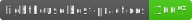

# Tereze Medne

Art portfolio website: https://www.terezemedne.com/

## Design

Designed by Tereze Medne, the application's design embraces minimalism, featuring a playful collage like masonry layout and placing the artist's work in the foreground. With responsivenes and mobile usage in mind, the layout transfers to a single column on smaller devices further focusing on the content itself.

## Stack

The application is developed using [Jamstack](https://jamstack.org/) principles with [Next.js](nextjs.org/). Styled with the default [Tailwind](tailwindcss.com/) theme.

It's hosted freely on [Netlify](https://www.netlify.com/) and uses [Netlify CMS](https://www.netlifycms.org/). ❤️

Through a customized admin panel, the CMS creates and merges a pull request with the changes. The content is publicly available, stored on the file system and the GitHub repository itself.

The HTML files are generated by the Next.js `export` command with the MDX content being parsed by `gray-matter` and loaded by `next-mdx-remote` packages.
### sharp

A [sharp](https://sharp.pixelplumbing.com/) script (`scripts/sharp.js`) is used at build time to 
* load image settings from `constants/images.js`
* load images from `UPLOADS_DIR`
* create responsive JPEG and PNG images with [WebP](https://web.dev/serve-images-webp/) counterparts to `RESIZED_DIR` using `IMAGE_WIDTHS`, `IMAGE_QUALITY`
* create HTMLImageElement `width`, `height`, mapped `src-set` and `src` attributes to `IMAGE_ATTRIBUTES_URI` 

Afterwards the resized images are used through an image loader (`loaders/resizedLoader` by default) in a custom `<Image />` component.

## Lighthouse

